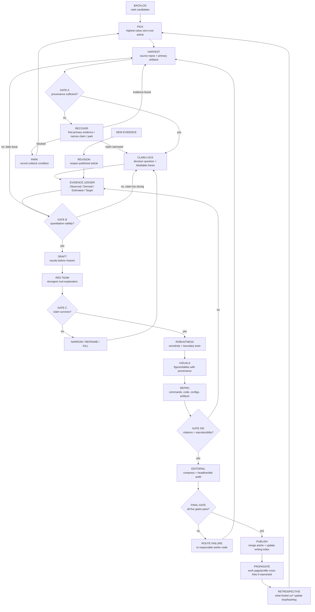

# /loop — research writing graph

This is the control loop for turning the personal writing backlog into **Suwappu-grade, evidence-first research** without letting any single blocked experiment stall publication.

The existing [`RESEARCH_TEMPLATE.md`](./RESEARCH_TEMPLATE.md) and [`research-standard.html`](./research-standard.html) define the quality bar. This file defines **how work moves through that bar repeatedly**.

## Operating constraints

1. **No paid experiments.** The loop may use existing repository artifacts, free/local computation, public primary sources, and zero-cost CI. If a claim requires paid inference, paid data, or paid hardware access, the loop must either:
   - narrow the claim to what is already supported;
   - find a zero-cost proxy that is explicit about its limits; or
   - park the article and select the next one.
2. **Primary evidence before prose.** Source code, benchmark outputs, CI logs, merged PRs, papers, specifications, and raw measurements outrank summaries.
3. **The claim must be weaker than or equal to the evidence.** Never upgrade an estimate into an observation or a target into a result.
4. **Negative results are publishable results.** A failed hypothesis is preferred to a polished but weak story.
5. **No article may hold the queue hostage.** A blocked piece is parked with an explicit unblock condition and the loop immediately picks the next eligible item.
6. **One branch, one article.** Each article gets an isolated `writing/<slug>` branch and a focused PR.
7. **Publication is not terminal.** New evidence reopens the article through the revision node.

## Graph

## Node contracts

### 0. BACKLOG
**Input:** candidate essays, manuscripts, project postmortems, upstream contributions, negative results.  
**Output:** ranked entries in [`backlog.json`](./backlog.json).

Prioritize pieces with:
- independently reviewable evidence;
- a non-obvious result or failure;
- direct relevance to systems / ML / autonomy / scientific computing;
- primary artifacts already in public repos;
- a path to completion without paid experiments.

### 1. PICK
Select the highest-value article that is not `published` or `parked` and has `zero_cost_path: true`.

Tie-breakers:
1. stronger external validation;
2. harder quantitative evidence;
3. more surprising thesis;
4. stronger Anthropic / OpenAI / SpaceX relevance;
5. lower remaining completion cost.

### 2. HARVEST
Before drafting, collect the evidence package:
- source repo and exact files;
- raw benchmark/result artifacts;
- relevant CI/workflow logs;
- merged upstream PRs or issue discussions;
- primary papers/specifications needed for external context;
- known contradictory artifacts.

Do **not** summarize from memory if the artifact can be inspected.

### 3. CLAIM LOCK
Write three lines before writing the article:
- **Decision question:** why a technical reader should care.
- **Claim:** one falsifiable sentence.
- **Boundary:** the strongest thing the evidence does *not* establish.

If the claim changes materially later, return here and rebuild the evidence ledger.

### 4. EVIDENCE LEDGER
Every consequential claim gets:
- evidence class: `observed | derived | estimated | target`;
- exact artifact/source;
- denominator, units, comparison set and time window where applicable;
- reproduction status;
- known caveat.

A sentence without a defensible evidence class is commentary, not a result.

### 5. QUANTITATIVE VALIDITY
Attack every number:
- correct denominator?
- enough replicates/seeds?
- comparison baseline appropriate?
- uncertainty reported honestly?
- parameter choice cherry-picked?
- stale pricing/model/version assumptions?
- hidden subset or empty rows?

If the number fails, fix the measurement or weaken the claim. Never write around it.

### 6. DRAFT
Recommended article order:
1. result / surprise;
2. why the prior expectation was plausible;
3. method;
4. evidence;
5. mechanism or interpretation;
6. rival explanation;
7. limitations;
8. what would change the conclusion;
9. reproducibility and primary sources.

### 7. RED TEAM
Write the strongest interpretation that makes the headline wrong.

Minimum attacks:
- selection bias;
- leakage / contamination;
- proxy-task mismatch;
- shared-assumption failure between implementation and test;
- confounding parameter choice;
- evaluator/judge dependence;
- out-of-distribution generalization;
- survivor / publication bias;
- alternate causal mechanism.

If the rival explains the evidence equally well, narrow the thesis.

### 8. ROBUSTNESS
Use zero-cost sensitivity checks where possible:
- alternate parameter values already present in results;
- domain/subset breakdowns;
- seed spread;
- exact vs semantic scoring;
- before/after comparisons;
- negative controls;
- leave-one-group-out checks;
- historical artifact comparison.

No paid rerun is required to publish a bounded result. State what remains unknown.

### 9. VISUALS
A figure earns its place only if it carries evidence.

Every figure/table must include:
- takeaway;
- units and denominator;
- provenance;
- observed vs derived distinction;
- uncertainty if material;
- no decorative precision.

### 10. REPRO
Link the smallest useful reproduction surface:
- exact command;
- code path;
- data/result artifact;
- environment/config;
- CI workflow or log where relevant.

If a result cannot be reproduced without a paid dependency, publish the existing immutable artifact and explicitly state that limitation.

### 11. FINAL GATE
All must pass:
- **A Provenance** — consequential claims trace to primary evidence.
- **B Quantitative validity** — numbers expose denominator, units, assumptions, and uncertainty/sensitivity.
- **C Adversarial thesis** — strongest rival is tested or left explicitly unresolved.
- **D Citation integrity** — adjacent source supports the exact claim.
- **E Reproducibility** — artifact is linked or impossibility is explicit.
- **Editorial** — headline and conclusion are no stronger than the body.

### 12. PUBLISH
Publication means:
- article merged to `portfolio/main`;
- `writing/index.html` updated;
- source repo linked;
- version + revision log included;
- backlog status set to `published`;
- next article selected immediately.

### 13. RETROSPECTIVE
After each article, record at least one thing the loop caught:
- misleading metric;
- stale assumption;
- overclaim;
- hidden subset;
- weak citation;
- failed counterargument;
- missing artifact.

If the same failure appears twice, update the loop itself.

## Failure routing

| Failure | Route to |
|---|---|
| Source does not support sentence | HARVEST / EVIDENCE LEDGER |
| Number changes under a reasonable denominator | QUANTITATIVE VALIDITY |
| Rival explanation fits equally well | CLAIM LOCK |
| Requires paid experiment | RECOVER → narrow / proxy / park |
| Figure is decorative or misleading | VISUALS |
| Reproduction requires unavailable artifact | REPRO or narrow claim |
| Headline stronger than evidence | EDITORIAL / CLAIM LOCK |
| New post-publication evidence | REVISION |

## Definition of done for the overall loop

The loop is not “done” when one essay is good. It is healthy when:
- every publishable evidence-rich item in `backlog.json` is either `published` or explicitly `parked` with an unblock condition;
- the writing index accurately distinguishes research, engineering notes, design notes and future targets;
- no queued article relies on a paid experiment to move the rest of the queue;
- every published technical article exposes its primary evidence and limitations on-page.
